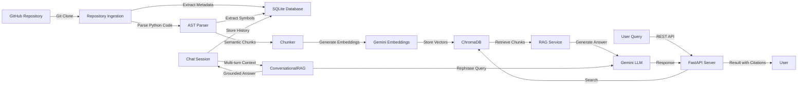

# Archaeon — AI Software Archaeologist

> An autonomous Code Intelligence and Semantic Retrieval system combining AST static analysis, vector embeddings, and grounded LLM reasoning to explain **how** and **why** software systems evolve.

---

## Table of Contents

- [Features](#features-across-completed-phases)
- [System Architecture](#system-architecture)
- [Quick Start](#quick-start)
- [API Reference](#api-endpoints)
- [Testing](#running-tests)
- [Documentation](#documentation)
- [Roadmap](#project-roadmap)

---

## Features Across Completed Phases

### Phase 1 — Foundations (Completed)

| Feature | Description |
|---------|-------------|
| **FastAPI REST API** | Modular endpoints with `APIRouter`, Pydantic v2 schemas, and interactive OpenAPI documentation (`/docs`) |
| **SQLAlchemy 2.0 ORM & SQLite** | Multi-threaded SQLite database engine managing repository state and background ingestion tasks |
| **Asynchronous Git Ingestion** | Clones GitHub repositories and extracts metadata using `GitPython` and FastAPI `BackgroundTasks` |
| **Automated Testing** | Comprehensive unit tests covering API routes, ORM models, and schemas |

### Phase 2 — Code Intelligence & Static Analysis (Completed)

| Feature | Description |
|---------|-------------|
| **Python AST Parser** | Built with native `ast.NodeVisitor` to safely extract classes, inheritance hierarchies, functions, methods, imports, docstrings, and exact line boundaries |
| **File Discovery** | Discovers all Python source files while filtering out `.git`, `.venv`, and `__pycache__` |
| **Relational Symbol Mapping** | `files` and `symbols` SQLite tables with foreign key cascades and parent class relationships |
| **Progress Tracking** | Reports fine-grained background job progress (0% ➔ 50% clone, 50% ➔ 85% AST) |
| **Code Inspection** | Endpoints: `GET /repositories/{id}/files` and `GET /repositories/{id}/symbols` |

### Phase 3 — Semantic RAG Engine (Completed)

| Feature | Description |
|---------|-------------|
| **AST Semantic Chunker** | Slices code along logical syntax boundaries with prepended contextual headers |
| **Gemini Embeddings** | 3,072-dimensional embeddings via `models/gemini-embedding-001` with concurrent batching and LRU cache |
| **ChromaDB Vector Store** | Persistent vector database with cosine similarity search and metadata filtering |
| **Grounded Q&A** | `POST /repositories/{id}/query` with anti-hallucination guardrails and line-level citations |

### Phase 4 — Conversational Memory & LangChain (Completed)

| Feature | Description |
|---------|-------------|
| **Session Persistence** | SQLite-backed `ChatSession` and `Message` tables for multi-turn conversations |
| **Chat History** | Last 6 messages stored as LangChain `HumanMessage` / `AIMessage` objects |
| **Query Condensation** | Follow-ups reformulated into standalone searches for pronoun resolution |
| **LangChain LCEL Pipeline** | `ConversationalRAGService` integrates history, retrieval, and grounded generation |
| **Session Endpoints** | Create sessions, list, fetch history, and send chat messages |

---

## System Architecture



---

## Quick Start

### 1. Installation

```bash
# Clone the repository
git clone https://github.com/manuwastaken/software-archaeologist.git
cd software-archaeologist

# Create and activate virtual environment
python -m venv .venv
.venv\Scripts\activate      # Windows PowerShell
# source .venv/bin/activate # Linux / macOS

# Install dependencies
pip install -r requirements.txt
```

### 2. Configure Environment

Create a `.env` file in the project root:

```bash
GEMINI_API_KEY=your_gemini_api_key_here
```

### 3. Start the Server

```bash
uvicorn src.api.main:app --reload
```

**API Documentation:** http://127.0.0.1:8000/docs

---

## API Endpoints

| Method | Endpoint | Description |
|--------|----------|-------------|
| `POST` | `/repositories` | Submit a GitHub repository URL for ingestion |
| `GET` | `/repositories` | List all ingested repositories |
| `GET` | `/repositories/{id}` | Get metadata and status for a repository |
| `GET` | `/repositories/{id}/files` | List files discovered during ingestion |
| `GET` | `/repositories/{id}/symbols` | List all extracted AST symbols (classes, functions, methods) |
| `POST` | `/repositories/{id}/query` | Ask a natural language question about the codebase (RAG) |
| `POST` | `/repositories/{id}/sessions` | Create a new chat session for a completed repository |
| `GET` | `/repositories/{id}/sessions` | List all chat sessions for a repository |
| `GET` | `/sessions/{session_id}/messages` | Fetch the stored message history for a session |
| `POST` | `/sessions/{session_id}/chat` | Ask a follow-up question using conversational memory and grounded retrieval |
| `GET` | `/jobs/{id}` | Check background ingestion job progress (0% - 100%) |

---

## Running Tests

**Unit Tests** (13 tests, local execution, zero API calls):
```bash
pytest tests/unit -v
```

**Live Integration Test** (requires Gemini API):
```bash
pytest tests/unit/integration/test_live_rag.py -s -v
```

---

## Documentation

Comprehensive architectural guides for each phase are located in `docs/concepts/`:

#### Phase 1 — Foundations
- [LLM Basics](docs/concepts/step1_llm_basics.md) — API keys, models, prompts, tokens, and temperature
- [FastAPI Basics](docs/concepts/step2_fastapi_basics.md) — HTTP, REST, routers, dependency injection, and Pydantic
- [SQLAlchemy Basics](docs/concepts/step3_sqlalchemy_basics.md) — ORM, SQLite, session lifecycle, and engine configuration
- [Phase 1 Architecture](docs/concepts/phase1_codebase_guide.md) — API and Git clone pipeline

#### Phase 2 — Code Intelligence
- [Code Analysis Guide](docs/concepts/phase2_codebase_guide.md) — Python AST parsing, symbol extraction, and database models

#### Phase 3 — Semantic RAG
- [Semantic Chunking](docs/concepts/phase3_step1_semantic_chunker.md) — AST-based chunking and context headers
- [Embeddings & Vector Store](docs/concepts/phase3_step2_embeddings_and_vector_store.md) — Gemini embeddings, concurrency, LRU cache, and ChromaDB
- [Grounded Q&A](docs/concepts/phase3_step3_grounded_rag_service_and_api.md) — RAG pipeline and Q&A endpoints

#### Phase 4 — Conversational Memory
- [LangChain Basics](docs/concepts/phase4_langchain_basics.md) — LCEL, message objects, and chat history
- [Session Endpoints](docs/concepts/phase4_session_chat_endpoints.md) — Multi-turn conversation design

---

## Project Roadmap

- [x] **Phase 1:** API Skeleton, SQLite Database, Git Ingestion Engine, & Unit Tests
- [x] **Phase 2:** Code Intelligence (Python AST Parsing & Symbol Extraction)
- [x] **Phase 3:** RAG System (Embeddings, ChromaDB Vector Search, & Grounded Q&A)
- [x] **Phase 4:** LangChain Integration & Conversational Memory
- [ ] **Phase 5:** Tool-Using Agent Layer
- [ ] **Phase 6:** Archaeology (Git History, Diffs, & GitHub Issues/PRs)
- [ ] **Phase 7:** MLOps & Automation (n8n, Docker, & PostgreSQL + pgvector)
- [ ] **Phase 8:** Evaluation Dataset, Benchmarks, & v1.0 Release
