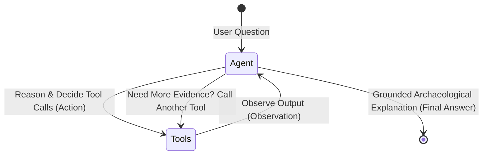

# Phase 5 — Autonomous ReAct Agents & LangGraph Explained from Scratch

This guide explains **ReAct Agents**, **LangGraph**, **Tool Calling**, and **Agent Orchestration** for developers who want to understand autonomous AI architecture from first principles.

---

## 1. The Paradigm Shift: Passive RAG vs. Active ReAct Agent

In **Phase 4**, Archaeon operated as a **Passive Conversational RAG Pipeline**:
```text
User Question ──▶ Query Condensation ──▶ Vector Search (top-4 chunks) ──▶ LLM Generates Answer
```
This is a **one-way street (DAG)**. It works well for simple questions, but breaks down during real software engineering investigations:
- If the vector search returns irrelevant chunks, the model cannot adjust course.
- It cannot inspect exact definitions in the database.
- It cannot read surrounding context or follow function calls across files.

In **Phase 5**, Archaeon becomes an **Active ReAct Agent (Reasoning + Acting)**:


The agent runs a continuous **Thought $\rightarrow$ Action $\rightarrow$ Observation $\rightarrow$ Thought** loop until it has gathered sufficient grounded evidence to answer with 100% confidence.

---

## 2. Tools Architecture (`src/agents/tools.py`)

A **Tool** is a Python function wrapped with LangChain’s `@tool` decorator that gives the LLM the ability to interact with the outside world (databases, filesystems, search engines).

### The Tool Factory Pattern & Closures
Instead of defining global tools, we wrap them in `build_archaeon_tools(repository_id, db, vector_store, embedding_service, clone_path)`.

#### Why Use a Factory?
1. **Airtight Tenant Isolation**: The LLM is never trusted to supply `repository_id`. If the model had to pass it, it might hallucinate UUIDs or access another project.
2. **Lexical Closures**: In Python, functions defined inside another function remember the outer variables. When LangChain inspects `@tool def codebase_search(query: str):`, the generated JSON schema only shows `query`. But when executed, it uses the server's `repository_id` and database session automatically.

### The 3 Core Tools:

| Tool | Role | Analogy | Data Source |
| :--- | :--- | :--- | :--- |
| **`codebase_search`** | Broad conceptual & feature search | **Telescope** | ChromaDB (Vector Embeddings) |
| **`symbol_lookup`** | Instant AST symbol discovery | **Index Card** | SQLite (`symbols` joined with `files`) |
| **`file_read`** | Bounded source code inspection | **Microscope** | Cloned repository on disk |

### The Golden Rule: Defensive Tool Design
> **Never let a tool raise an unhandled exception.**

If `file_read` raises a `FileNotFoundError`, the entire application crashes. 
Instead, we wrap tool bodies in `try...except Exception as e:` and return an informative error string:
```text
"Error: File 'src/not_found.py' does not exist in the repository."
```
The LLM reads this string as a `ToolMessage`, realizes its mistake, and **self-corrects** on the next iteration (e.g. trying `codebase_search` instead).

---

## 3. LangGraph: The State Machine Framework

Older agent frameworks like `AgentExecutor` relied on string regex parsing and hidden loops. 

**LangGraph** models agents as explicit **State Machines**:

### Building Block 1: `AgentState` & The Reducer
```python
class AgentState(TypedDict):
    messages: Annotated[list[BaseMessage], add_messages]
```
- `TypedDict`: A typed dictionary holding the state.
- `add_messages`: A **reducer function**. Instead of overwriting the message list on each step, it **appends** new messages (preserving conversation history and tool observations).

### Building Block 2: Nodes (The Workers)
1. **The `agent` node**: Invokes Gemini with tools bound via `llm.bind_tools(tools)`. It outputs an `AIMessage`.
2. **The `tools` node**: LangGraph’s prebuilt `ToolNode(tools)`. It parses any `tool_calls` in the `AIMessage`, executes the matching Python functions, and appends `ToolMessage`s.

### Building Block 3: Edges (The Flowchart)
```python
workflow.add_edge(START, "agent")
workflow.add_conditional_edges("agent", tools_condition)
workflow.add_edge("tools", "agent")
```
- `START -> agent`: The conversation begins at the model.
- `tools_condition`: A conditional edge. If the model requested tools, route to `"tools"`. If the model provided a final answer, route to `END`.
- `tools -> agent`: After tools run, loop back so Gemini can observe the results and reason further.

### Building Block 4: Guardrails (`recursion_limit`)
To prevent infinite tool loops from burning your API budget, LangGraph enforces a strict recursion limit:
```python
app.invoke({"messages": ...}, config={"recursion_limit": 15})
```
If the agent fails to converge in 15 steps, it halts safely.

---

## 4. Citation Extraction from Intermediate Steps

Unlike passive RAG where citations come from pre-fetched chunks, an agent’s citations come from its **actual actions**.

In `ArchaeonAgentService._extract_citations()`, we scan the conversation history in `final_state["messages"]`:
- When an `AIMessage` calls `file_read(file_path="src/parser.py", start_line=15, end_line=45)`, we extract exact file coordinates.
- When it calls `symbol_lookup(name="SymbolVisitor")`, we record the inspected symbol.

The user receives not only a grounded answer, but verified line-level references of what the agent examined.

---

## 5. Beyond Single Agents: Multi-Agent Architectures

As AI systems scale, a single agent with 30 tools suffers from context pollution. Modern systems use **Multi-Agent Teams**:

1. **Supervisor Pattern (Hierarchical)**: A Lead Agent routes tasks to specialized workers (`ResearchAgent`, `CoderAgent`, `QAAgent`).
2. **Assembly Line (Sequential)**: Output of Agent A feeds into Agent B feeds into Agent C (e.g., Architect $\rightarrow$ Coder $\rightarrow$ Reviewer).
3. **Collaborative Swarm (Handoffs)**: Agents directly transfer conversation context to peers using handoff tools.

---

## 6. What Remains in Phase 5?

Here is our exact roadmap to complete Phase 5:

1. [x] **Tool Implementation**: `src/agents/tools.py` with factory closures.
2. [x] **Tool Unit Testing**: `tests/unit/test_agent_tools.py` (17 tests passing, 0 API quota).
3. [x] **Agent Orchestrator**: `src/agents/orchestrator.py` with LangGraph `StateGraph`.
4. [ ] **Orchestrator Unit Testing**: Fast unit tests mocking the LLM and verifying graph execution flow.
5. [ ] **FastAPI Integration**: Expose an endpoint `POST /sessions/{session_id}/agent-chat` (or an `agent_mode` flag) in `src/api/routes/repository.py`.
6. [ ] **API Regression Verification**: Ensure both standard chat and agent chat function cleanly with database message persistence.
